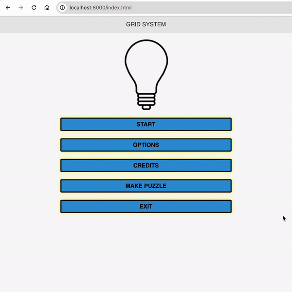

# grid-line

Play the game here: [https://gridline.vercel.app/](https://gridline.vercel.app/)


A fun and relaxing puzzle game created using cordova and javascript.

It works best on phone browsers!!!

You can even install it as a [PWA on your phone](https://www.cdc.gov/niosh/mining/tools/installpwa.html#:~:text=Installing%20a%20PWA%20on%20Android&text=First%2C%20navigate%20to%20the%20site%20in%20Chrome.,available%20on%20your%20home%20screen.).

The game's goal is to connect the gird lines to form a complete path linking the generators and the homes.



| This game is a POC and not intended for production use.

You need to have access to the internet to play this game. It contains a page to create new puzzles but you need to be registered to use it.

# Install & Run
```
# install npm
sudo apt install -y npm
# install cordova locally
npm install -g cordova
cordova platform add browser
cordova run browser
```
